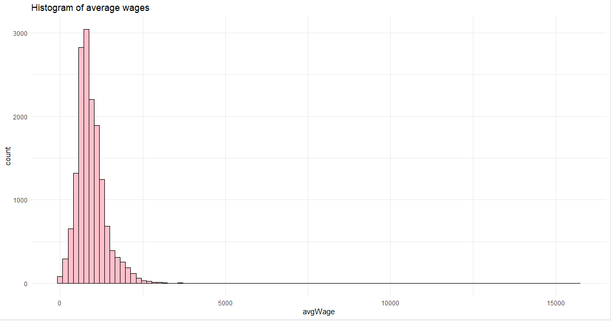
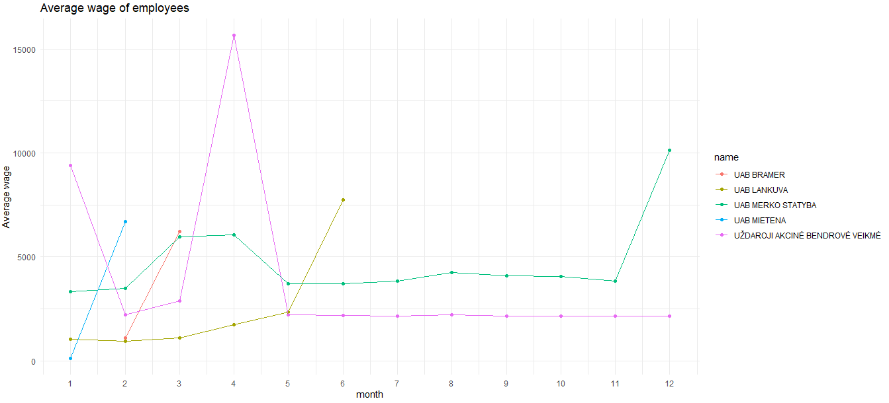
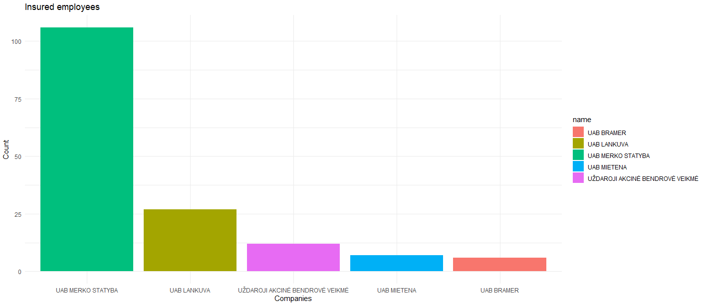
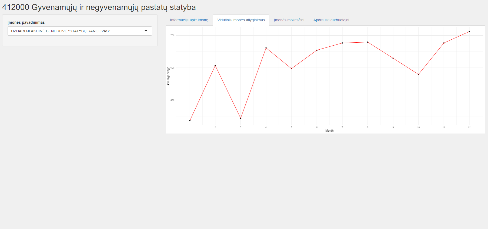

# R Laboratorinis darbas: duomenų vizualizacija

| Variantas | ecoActCode |
|------------- | ------------- |
|1   | 	412000 |

### 1. Užduotis

Atsakymas:

Išvados: Gyvenamųjų ir negyvenamųjų pastatų statybų įmonių vidutinis atlyginimas siekia 937.25€. Didžiausias gautas atlyginimas buvo 15664.72€, o mažiausias atlygis 3.96€.

### 2. Užduotis

Atsakymas:

Išvados: 5 įmonės su didžiausiais vidutiniais atlyginimais yra: "UAB BRAMER", "UAB LANKUVA", "UAB MERKO STATYBA", "UAB MIETENA", "UŽDAROJI AKCINĖ BENDROVĖ VEIKMĖ". Galime pastebėti, jog "UAB MIETENA", "UAB BRAMER", "UAB LANKUVA" neturi pakankamai duomenų, kad juos galėtume atvaizduoti kiekvieno mėnesio atžvilgiu. Taip pat matome, jog "UAB MIETENA", "UAB BRAMER" vidutinė alga tik kilo, o "UAB LANKUVA" vidutinė alga vasario mėnesį buvo mažesnė nei sausį, tačiau nuo kovo mėnesio iki gegužės vidutinė alga tik kilo.
Įmonėje "UAB MERKO STATYBA" metų eigoje vidutinė alga svyravo - buvo matomos ir didėjimo ir mažėjimo tendencijos, tačiau gruodžio mėnesį vidutinė alga perkopė visas prieš tai buvusias ribas. "UŽDAROJI AKCINĖ BENDROVĖ VEIKMĖ" tais metais patyrė ir didžiausias aukštumas ir žemiausias mažumas. Nors sausio mėnesį vidutinė alga buvo ganėtinai aukšta, vasario mėnesį ji gerokai sumažėjo, o atėjus pavasariui algos pradėjo ženkliai didėti ir tai lėmė aukštas vidutines darbuotojų pajamas. Deja, tai buvo neilgam ir gegužės mėnėsį įvyko didžiulis algų mažėjimas, kuris praktiškai išliko iki metų pabaigos.

### 3. Užduotis

Atsakymas:

Išvados: Galime pastebėti, jog įmonė "UAB MERKO STATYBA" pirmauja pagal apdraustų darbuotojų skaičių, o visos likusios įmonės deja, bet turi labai mažą apdraustų darbuotojų skaičių ir ženkliai atsilieka nuo įmonės "UAB MERKO STATYBA".

### 4. Užduotis

Shiny R aplikacijos nuotrauka:

